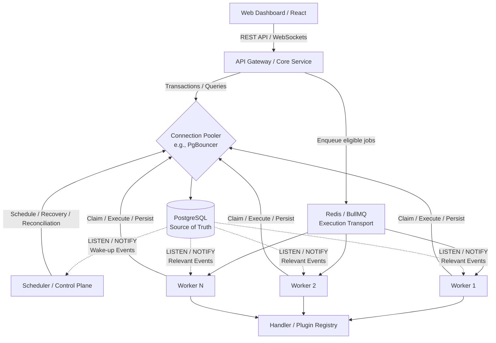
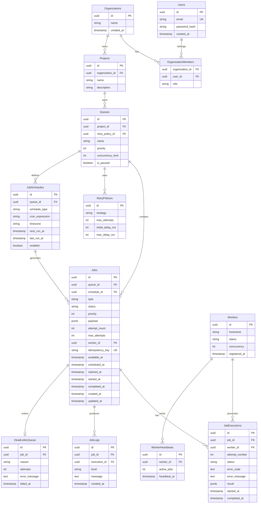

# Detailed Prompt for Atlas (Distributed Job Scheduler)

## Problem Statement:

Design and build Atlas, a production-grade distributed job scheduling platform capable of reliably creating, scheduling, dispatching, and executing asynchronous background jobs across multiple distributed workers. Atlas must manage the complete lifecycle of individual job instances while separating schedule definitions from their generated executions. It must support immediate, delayed, scheduled, recurring (cron), and batch jobs, with queues providing priority, concurrency limits, pause/resume, and retry policies. The system must emphasize reliability, modular architecture, transactional concurrency control, idempotent execution, comprehensive relational database design, structured REST APIs, worker recovery, and observability. A responsive web dashboard is required for complete system management and monitoring.

## Tool, Stack:

- **Backend Framework:** Node.js with TypeScript using Express or NestJS for a strongly-typed, modular, and scalable API and control-plane server.
- **Database:** PostgreSQL as the sole authoritative source of truth. Use normalized relational tables, foreign keys, constraints, indexes, transactions, and `SELECT ... FOR UPDATE SKIP LOCKED` for atomic job claiming.
- **Execution Transport:** Redis with BullMQ for asynchronous job dispatch, delayed delivery, worker distribution, and execution transport. Redis must not be treated as the authoritative source of job state.
- **Connection Pooling:** PgBouncer or an equivalent PostgreSQL connection pooler to manage connections from API, scheduler, and distributed workers.
- **Event Notification:** PostgreSQL `LISTEN/NOTIFY` for lightweight wake-up and control-plane notifications. Notifications must not be treated as durable job messages.
- **Frontend:** React with TypeScript using Next.js or Vite and Tailwind CSS for the dashboard. Recharts may be used for metrics visualization and React Query for API state management.
- **Real-time Communication:** WebSockets using Socket.io for optional live dashboard telemetry.
- **ORM:** Prisma or TypeORM for migrations and type-safe relational access, with raw SQL allowed for critical operations such as `FOR UPDATE SKIP LOCKED`.

## Architecture Design:

- **Frontend Dashboard:** A SPA interacting with the backend through REST APIs and WebSockets to manage projects and queues, inspect jobs and executions, monitor workers, inspect the DLQ, and visualize throughput and system health.
- **API Gateway / Core Service:** Handles authentication, authorization, project and queue management, job creation, schedule management, validation, idempotency, and dashboard APIs.
- **Scheduler / Control Plane:** A dedicated service responsible for evaluating schedule definitions, creating job instances when schedules become due, promoting delayed/retryable work, detecting stale workers, recovering orphaned jobs, and reconciling PostgreSQL state with the execution transport.
- **Execution Transport:** Redis/BullMQ is used to dispatch eligible job instances to workers. It is a transport/runtime layer, not the source of truth.
- **Distributed Worker Nodes:** Stateless worker processes that receive or pull executable work, atomically claim jobs in PostgreSQL using row-level locking, execute registered handlers, record execution history, send heartbeats, apply retry policies, and support graceful shutdown.
- **Database Layer:** PostgreSQL is the authoritative source of truth for organizations, projects, queues, schedules, jobs, executions, logs, workers, heartbeats, and DLQ entries. Critical state transitions must use transactions where consistency requires them.
- **Event-Driven Wakeups:** PostgreSQL `LISTEN/NOTIFY` is used as a lightweight wake-up mechanism for schedulers or workers when relevant database events occur. Missed notifications must not cause job loss; periodic reconciliation remains available.
- **Handler / Plugin Layer:** Job-specific behavior is implemented through a registry of handlers so that workers remain generic. A job references a handler type and payload rather than embedding execution logic in the worker runtime.
- **Telemetry & Logging:** Every execution attempt, state transition, retry, worker assignment, heartbeat, and failure is recorded in PostgreSQL. The dashboard derives operational metrics from this durable history.



## Repo Structure:

```text
atlas/
│
├── README.md                         # REQUIRED
├── .env.example                      # REQUIRED
│
├── docs/
│   ├── architecture.md               # REQUIRED
│   ├── api.md                        # REQUIRED
│   ├── database.md                   # REQUIRED (Contains the ER Diagram)
│   ├── decisions.md                  # REQUIRED
│   ├── testing.md
│   ├── deployment.md
│   ├── failure-recovery.md
│   ├── state-machine.md
│   ├── sequence-diagrams.md
│   │
│   └── assets/
│       ├── architecture.png          # REQUIRED
│       ├── er-diagram.png            # REQUIRED
│       ├── job-state-machine.png
│       ├── job-execution-sequence.png
│       └── worker-recovery.png
│
├── server/                           # Node.js API, Scheduler & Workers
├── client/                           # React SPA Dashboard
├── tests/                            # REQUIRED by rubric
│
└── scripts/
```

## Architecture Decisions you made:

1. **PostgreSQL as the Authoritative Source of Truth:** PostgreSQL owns all durable job, schedule, execution, worker, retry, log, and DLQ state. Redis/BullMQ is never treated as the canonical state store.

2. **Scheduler + Execution Transport Separation:** Atlas separates scheduling decisions from execution delivery. The scheduler determines when a job instance becomes eligible, while Redis/BullMQ transports executable work to distributed workers.

3. **Event-to-Job Model:** A schedule definition represents what should happen and when. Each actual invocation creates an independent job instance. This separates recurring/scheduled intent from execution history and allows every execution to be tracked independently.

4. **Atomic PostgreSQL Claiming:** Workers use a PostgreSQL transaction with `SELECT ... FOR UPDATE SKIP LOCKED` to atomically claim eligible jobs. Redis does not provide the correctness guarantee for claiming; PostgreSQL does.

5. **LISTEN/NOTIFY as a Wake-up Mechanism:** PostgreSQL notifications are used to reduce unnecessary polling and wake interested schedulers/workers when relevant events occur. Notifications are not durable job messages, and reconciliation ensures missed notifications cannot cause data loss.

6. **Redis/BullMQ as Execution Transport:** BullMQ provides asynchronous dispatch, delayed delivery, and worker distribution. Durable job state remains in PostgreSQL so Redis loss does not become loss of truth.

7. **Decoupled Worker Pattern with Connection Pooling:** API, scheduler, and workers are independently scalable processes. A connection pooler protects PostgreSQL from excessive connection counts while allowing controlled concurrent database access.

8. **Explicit Job State Machine:** Job instances follow validated transitions such as `SCHEDULED → QUEUED → CLAIMED → RUNNING → COMPLETED/FAILED`, with retryable failures returning to a future eligible state and permanent failures entering the DLQ.

9. **Database-Backed Heartbeats and Recovery:** Workers periodically update heartbeat state. The scheduler/control plane detects stale workers and safely recovers jobs that were left claimed or running.

10. **Granular Execution History:** Jobs and job executions are separate entities. A job may have multiple execution attempts, each with its own worker assignment, timestamps, duration, status, errors, and result.

11. **Handler / Plugin Registry:** Worker infrastructure is generic. Job-specific behavior is selected through a registered handler type, allowing Atlas to support multiple kinds of executable jobs without coupling the worker runtime to one implementation.

12. **Graceful Shutdown:** Workers handle SIGINT/SIGTERM, stop accepting new work, finish or safely release in-flight work according to shutdown policy, persist final state, and deregister cleanly.

13. **Reconciliation over Notification Dependence:** Scheduler and recovery loops periodically reconcile PostgreSQL state with Redis/BullMQ so temporary transport failures or missed notifications cannot permanently strand jobs.

## Core Requirements:

- Implement authentication and organization/project management where each project can own multiple job queues.
- Support queue configuration including priority, concurrency limits, retry policy, pause/resume, and statistics.
- Support schedule definitions for one-time scheduled jobs and recurring cron jobs.
- Separate schedule definitions from generated job instances using an Event/Schedule → Job model.
- Allow users to create immediate, delayed, scheduled, recurring (cron), and batch jobs through REST APIs.
- Build a scheduler/control-plane service that evaluates schedules, creates due job instances, promotes delayed/retryable jobs, detects stale workers, and performs reconciliation.
- Build a worker service that receives executable work through Redis/BullMQ, atomically claims jobs in PostgreSQL, executes handlers concurrently, sends heartbeats, and supports graceful shutdown.
- Implement the complete job lifecycle with validated state transitions: Scheduled → Queued → Claimed → Running → Completed/Failed, with appropriate retry and DLQ transitions.
- Support configurable retry strategies: fixed delay, linear backoff, and exponential backoff.
- Maintain comprehensive execution logs, retry history, worker assignment, timestamps, results, and metrics for every job.
- Implement idempotent job submission and execution safeguards to prevent duplicate effects where applicable.
- Create a web dashboard to manage queues, inspect schedules and jobs, monitor workers, inspect execution history and logs, retry failed jobs, replay DLQ entries, and visualize throughput and system health.
- Implement critical concurrency tests against the actual production claim path using multiple concurrent workers.

## Evaluation Criteria (Must be Complete First):

- **System Architecture (20 marks):** Modular, decoupled, efficient, and clearly separates scheduling, persistence, transport, and execution responsibilities.
- **Database Design (20 marks):** Normalized PostgreSQL tables, proper primary/foreign keys, indexes, constraints, cascading behavior, and a schema capturing the complete job lifecycle, schedules, executions, workers, and heartbeats.
- **Backend Engineering (20 marks):** Robust REST APIs with structured error handling, authentication, validation, atomic claims, transactional state transitions where required, and idempotent execution.
- **Reliability & Concurrency (15 marks):** Safe retries, Dead Letter Queue (DLQ), crash-resistant execution, heartbeats, stale-worker recovery, graceful shutdown, and proven concurrent claiming.
- **Frontend & UX (10 marks):** Responsive React dashboard showing queue health, schedules, job states, execution history, logs, and worker status.
- **API Design (5 marks):** Clean routing, validation, pagination, filtering, authentication, and structured responses/errors.
- **Documentation & Testing (10 marks):** Setup instructions, ER diagrams, architecture decisions document, state/sequence diagrams, API documentation, concurrency tests, recovery tests, and evidence for critical job-processing behavior.

## Bonus Features (Implement Only After Core is Stable):

1. **AI-Generated Failure Summaries:** Analyze DLQ stack traces and execution logs with an LLM to produce human-readable failure summaries and suggested debugging directions.
2. **WebSocket Live Updates:** Push real-time job, worker, queue, and scheduler telemetry to the React dashboard.
3. **Role-Based Access Control (RBAC):** Introduce organization/project roles such as Admin, Operator, and Viewer.
4. **Rate Limiting:** Protect REST APIs using Redis-backed rate limiting.
5. **Workflow Dependencies:** Support DAG-based jobs where jobs wait for prerequisite jobs to complete.
6. **Advanced Distributed Coordination:** Use PostgreSQL advisory locks or other coordination primitives for control-plane operations that are not covered by row-level job claiming.
7. **Queue Sharding:** Partition extremely large queues or workloads when measured database contention justifies the added complexity.
8. **Scheduler High Availability:** Support multiple scheduler instances with leader election/failover after the core system is stable.

## Modules Design:

1. **Identity & Access Module:** Handles user registration, authentication, authorization, organization membership, and project isolation.
2. **Queue Management Module:** CRUD operations for job queues and configuration such as priority, concurrency limits, pause/resume, retry policies, and queue statistics.
3. **Schedule Management Module:** Creates and manages schedule definitions, cron expressions, time zones, next-run calculation, enable/disable state, and schedule-to-job generation.
4. **Job Publisher Module:** Exposes REST endpoints to create immediate, delayed, scheduled, recurring, and batch jobs with validation and idempotency.
5. **Scheduler / Control Plane Module:** Evaluates due schedules, creates job instances, promotes delayed and retryable jobs, detects stale workers, performs recovery, and reconciles database and execution transport state.
6. **Execution Engine:** Runs inside workers. Receives work, atomically claims jobs, resolves registered handlers, executes jobs concurrently, catches failures, applies retry policies, and routes permanently failed jobs to the DLQ.
7. **Worker Orchestrator Module:** Handles worker registration, heartbeats, capacity/concurrency, graceful shutdown, stale-worker detection, and orphaned-job recovery.
8. **Handler / Plugin Module:** Provides the registry and interfaces for executable job handlers while keeping workers generic.
9. **Observability & Telemetry Module:** Provides paginated job and execution views, filters, logs, queue statistics, worker health, throughput metrics, and optional WebSocket broadcasts.

## Database Design:

The schema must use PostgreSQL relational modeling and explicitly represent organizational ownership, queue configuration, schedule definitions, job instances, execution attempts, worker state, logs, and DLQ entries.



## API Design:

- **Auth:**
  - `POST /api/v1/auth/register`
  - `POST /api/v1/auth/login`

- **Organizations & Projects:**
  - `GET /api/v1/organizations`
  - `POST /api/v1/organizations`
  - `GET /api/v1/organizations/:organizationId/projects`
  - `POST /api/v1/organizations/:organizationId/projects`
  - `GET /api/v1/projects/:projectId`

- **Queues:**
  - `GET /api/v1/projects/:projectId/queues`
  - `POST /api/v1/projects/:projectId/queues`
  - `GET /api/v1/queues/:queueId`
  - `PATCH /api/v1/queues/:queueId`
  - `PUT /api/v1/queues/:queueId/pause`
  - `PUT /api/v1/queues/:queueId/resume`
  - `GET /api/v1/queues/:queueId/stats`

- **Schedules:**
  - `POST /api/v1/queues/:queueId/schedules`
  - `GET /api/v1/queues/:queueId/schedules`
  - `GET /api/v1/schedules/:scheduleId`
  - `PATCH /api/v1/schedules/:scheduleId`
  - `DELETE /api/v1/schedules/:scheduleId`

- **Job Management:**
  - `POST /api/v1/queues/:queueId/jobs`
  - `POST /api/v1/queues/:queueId/jobs/batch`
  - `GET /api/v1/queues/:queueId/jobs`
  - `GET /api/v1/jobs/:jobId`
  - `GET /api/v1/jobs/:jobId/executions`
  - `GET /api/v1/jobs/:jobId/logs`
  - `POST /api/v1/jobs/:jobId/retry`
  - `POST /api/v1/jobs/:jobId/cancel`

- **DLQ:**
  - `GET /api/v1/dlq`
  - `GET /api/v1/dlq/:entryId`
  - `POST /api/v1/dlq/:entryId/replay`

- **Workers & Metrics:**
  - `GET /api/v1/workers`
  - `GET /api/v1/workers/:workerId`
  - `GET /api/v1/metrics`

