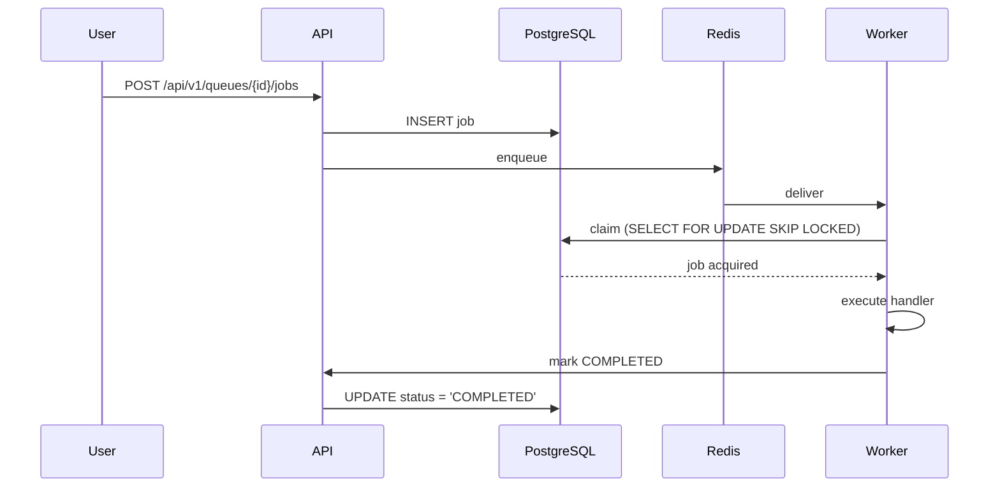
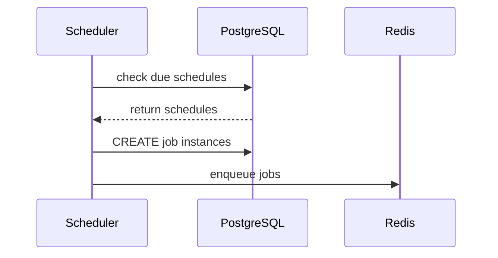
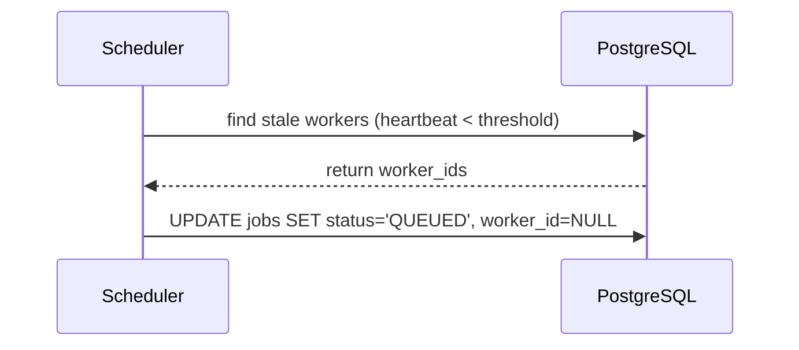

# Sequence Diagrams

This document illustrates how components interact over time.

## Immediate Job Execution

```mermaid
sequenceDiagram
    participant User
    participant API
    participant DB as PostgreSQL
    participant Redis
    participant Worker
    
    User->>API: POST /api/v1/queues/{id}/jobs
    API->>DB: INSERT job
    API->>Redis: enqueue
    Redis->>Worker: deliver
    Worker->>DB: claim (SELECT FOR UPDATE SKIP LOCKED)
    DB-->>Worker: job acquired
    Worker->>Worker: execute handler
    Worker->>API: mark COMPLETED
    API->>DB: UPDATE status = 'COMPLETED'
```

## Scheduled Job

```mermaid
sequenceDiagram
    participant Scheduler
    participant DB as PostgreSQL
    participant Redis
    
    Scheduler->>DB: check due schedules
    DB-->>Scheduler: return schedules
    Scheduler->>DB: CREATE job instances
    Scheduler->>Redis: enqueue jobs
```

## Worker Crash Recovery

```mermaid
sequenceDiagram
    participant Scheduler
    participant DB as PostgreSQL
    
    Scheduler->>DB: find stale workers (heartbeat < threshold)
    DB-->>Scheduler: return worker_ids
    Scheduler->>DB: UPDATE jobs SET status='QUEUED', worker_id=NULL
```
