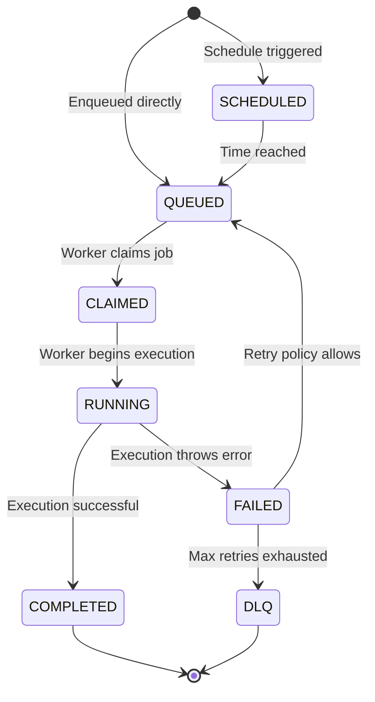

# Job State Machine

This documents the job lifecycle and valid transitions.

## Legal Transitions

- `QUEUED → CLAIMED`       (valid)
- `CLAIMED → RUNNING`      (valid)
- `RUNNING → COMPLETED`    (valid)
- `RUNNING → FAILED`       (valid)
- `COMPLETED → RUNNING`    (invalid)
- `FAILED → QUEUED`        (valid for retries)
- `FAILED → DLQ`           (valid on exhaustion)
